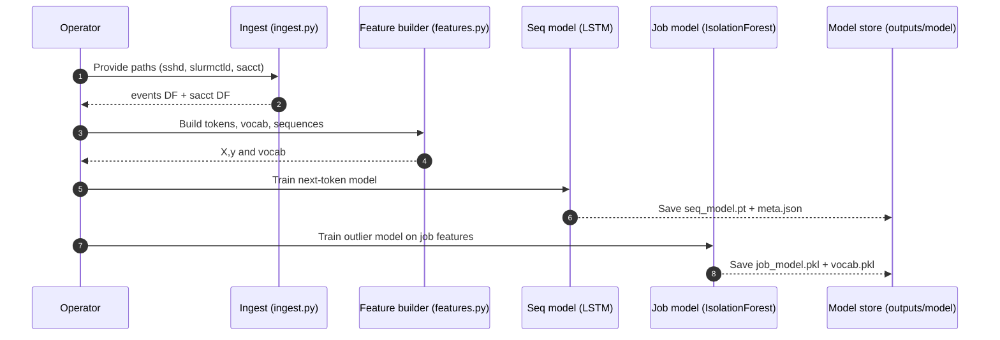
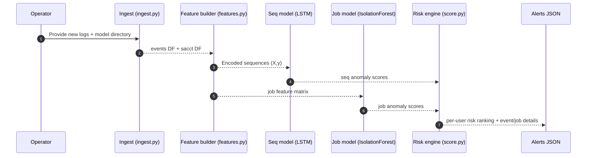

# Sequence Flow Diagram

This is the end‑to‑end flow of training and scoring.

## Training flow (Mermaid)

```mermaid
sequenceDiagram
  autonumber
  participant Ops as Operator
  participant Ingest as Ingest (ingest.py)
  participant Feat as Feature builder (features.py)
  participant Seq as Seq model (LSTM)
  participant Job as Job model (IsolationForest)
  participant Store as Model store (outputs/model)

  Ops->>Ingest: Provide paths (sshd, slurmctld, sacct)
  Ingest-->>Ops: events DF + sacct DF
  Ops->>Feat: Build tokens, vocab, sequences
  Feat-->>Ops: X,y and vocab
  Ops->>Seq: Train next-token model
  Seq-->>Store: Save seq_model.pt + meta.json
  Ops->>Job: Train outlier model on job features
  Job-->>Store: Save job_model.pkl + vocab.pkl
```

## Scoring flow (Mermaid)

```mermaid
sequenceDiagram
  autonumber
  participant Ops as Operator
  participant Ingest as Ingest (ingest.py)
  participant Feat as Feature builder (features.py)
  participant Seq as Seq model (LSTM)
  participant Job as Job model (IsolationForest)
  participant Risk as Risk engine (score.py)
  participant Out as Alerts JSON

  Ops->>Ingest: Provide new logs + model directory
  Ingest-->>Feat: events DF + sacct DF
  Feat-->>Seq: Encoded sequences (X,y)
  Seq-->>Risk: seq anomaly scores
  Feat-->>Job: job feature matrix
  Job-->>Risk: job anomaly scores
  Risk-->>Out: per-user risk ranking + event/job details
```
